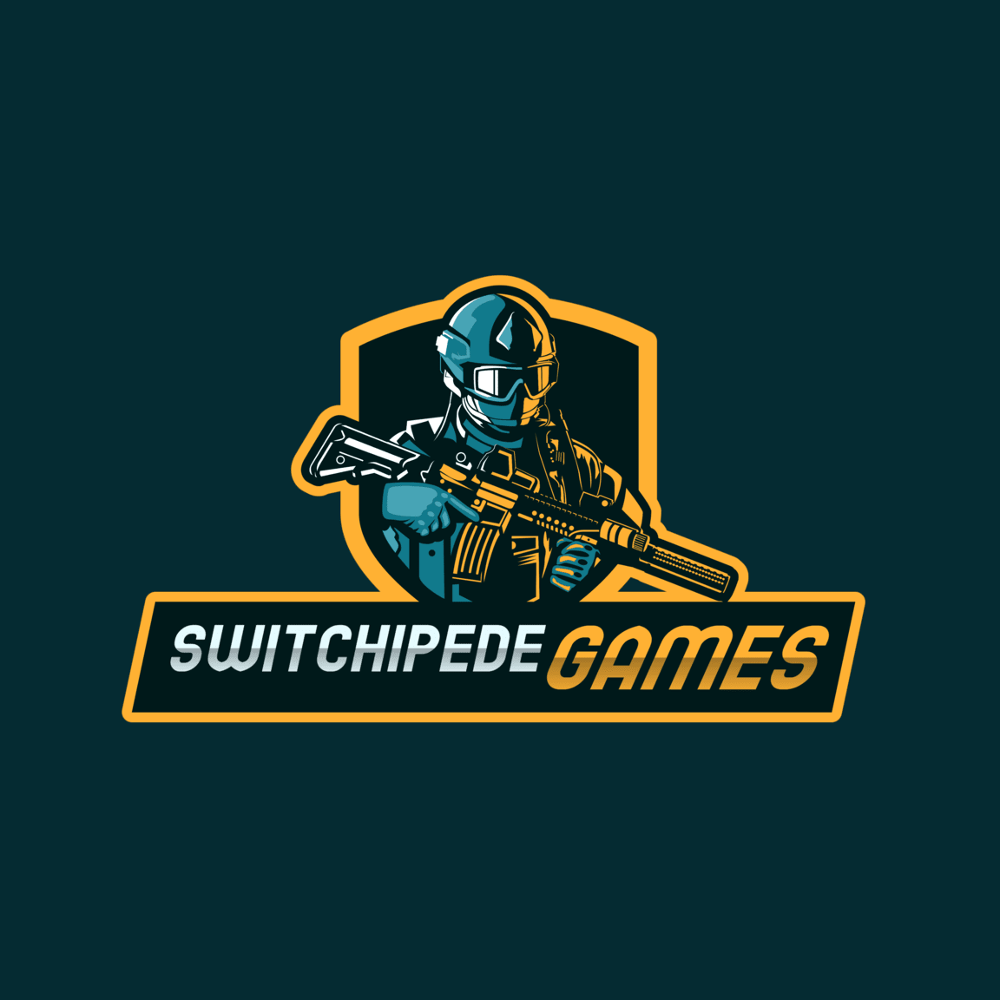

# Switchipede Games - Gaming Website

A modern, interactive website for gaming content creator Switchipede Games showcasing YouTube videos, game playthroughs, and channel information.



## Features

- **Responsive Design**: Fully responsive layout that works on mobile, tablet, and desktop
- **Interactive Elements**: Animated particles, smooth scrolling, and interactive video cards
- **Modern Aesthetics**: Gaming-inspired dark theme with neon accents and glowing elements
- **Performance Optimized**: Fast loading times with efficient JavaScript
- **Video Showcase**: Featured videos section with details like duration and view count
- **Games Gallery**: Showcase of featured games with direct links to YouTube playlists
- **About Section**: Information about the content creator with social links
- **Contact Form**: Functional contact form with validation
- **Animated UI**: Scroll animations and interactive elements throughout

## Structure

```
switchipedegame/
├── assets/
│   ├── css/
│   │   └── style.css
│   ├── js/
│   │   └── main.js
│   └── images/
│       ├── logo.png
│       ├── dbz.jpg
│       ├── sf6.jpg
│       ├── re4.jpg
│       └── tmnt.jpg
├── index.html
└── README.md
```

## How to Use

1. Clone the repository or download the files
2. Open `index.html` in your web browser to view the website
3. No build process or server required - it's pure HTML, CSS, and JavaScript

## Customization

### Changing Content

- **Videos**: Update the video cards in the HTML with your own video information
- **Games**: Replace the game images and links with your own featured games
- **About Info**: Update the about section with your personal information
- **Social Links**: Add your own social media links in the footer and about section

### Styling

- **Colors**: Modify the color scheme by changing the variables in the `:root` selector in `style.css`
- **Fonts**: Replace the Google Fonts imports in the HTML header
- **Images**: Replace images in the `assets/images` folder

## Browser Compatibility

- Chrome (latest)
- Firefox (latest)
- Safari (latest)
- Edge (latest)
- Opera (latest)
- Mobile browsers (iOS Safari, Android Chrome)

## Technologies Used

- HTML5
- CSS3 (Custom properties, Flexbox, Grid, Animations)
- JavaScript (ES6+)
- Font Awesome (for icons)
- Google Fonts (Orbitron and Roboto)

## Future Enhancements

- YouTube API integration to automatically fetch latest videos
- Dark/Light theme toggle
- Video filtering by game category
- Live stream status indicator
- Newsletter subscription functionality
- Comment system for videos

## Credits

- Logo: Switchipede Games
- Game images: Steam
- Fonts: Google Fonts
- Icons: Font Awesome

## License

This project is available for personal use by Switchipede Games.

---

Created for Switchipede Games © 2023 